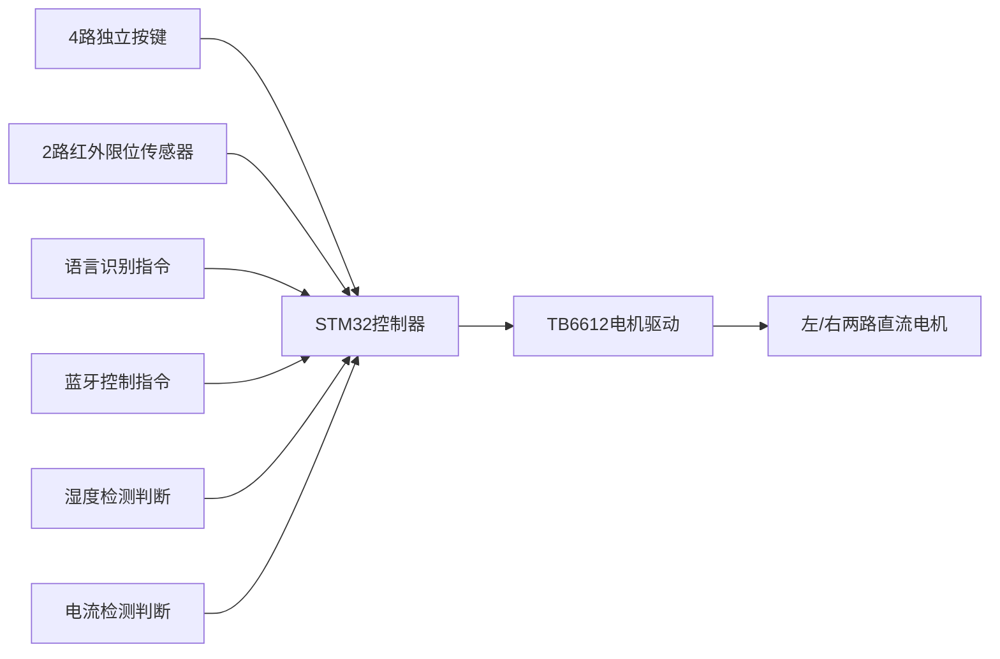

---
alias: 自动车窗毕设硬件测试&功能定义记录
tags:
  - 毕设
  - 自动车窗
  - STM32F1
  - 实测记录
category: 毕设项目
source: 26届本科毕设硬件调试实测记录
update: 2026-05-05
---
# 自动车窗毕设 硬件测试&功能定义记录
> [!toc] 快速检索
> | 模块 | 跳转链接 |
> | --- | --- |
> | 核心硬件参数 | [[#1. 核心硬件组件参数]] |
> | 车窗升降基础逻辑 | [[#2. 车窗升降核心逻辑]] |
> | 防夹功能 | [[#2.3 电流检测防夹功能]] |
> | 语音控制 | [[#2.4 语音识别控制]] |
> | 雨天自动关窗 | [[#2.5 雨天雾天自动关窗]] |
> | 蓝牙控制 | [[#2.6 蓝牙远程控制]] |

---

## 1. 核心硬件组件参数
### 1.1 STM32F103C8T6最小系统
最小系统包含4个核心部分：晶振电路、复位电路、电源电路、BOOT启动配置电路
> 关联笔记：[[STM32F1外部中断EXTI学习笔记]]、[[STM32F1定时器TIM学习笔记]]

### 1.2 130微型直流电机参数
| 供电电压 | 空转电流  | 完全堵转电流 |
| ---- | ----- | ------ |
| 3.3V | 300mA | 1.3A   |
| 5.0V | 400mA | 1.9A   |

> [!param] 过流保护实测参数（5V供电）
> - 启动豁免时间：200ms（启动尖峰电流阶段不判定过流）
> - 过流判定阈值：推荐1.1A（可选范围1.0~1.2A）
> - 过流持续判定：超过阈值持续80~120ms才触发保护
> - 保护触发动作：立即停机 + 反转1.5s泄压

---

## 2. 车窗升降逻辑
### 2.1 硬件架构


### 2.1 红外限位逻辑
- 使用*对射式蓝牙模块*
> 遮挡时，输出低电平
.  无遮挡时，输出高电平

- 面包板测试阶段无实际机械车窗结构，红外传感器默认处于常无遮挡状态，因此采用模拟限位逻辑，后续实物组装后切换为正常逻辑。

| 状态   | 正常机械结构逻辑          | 面包板模拟逻辑           | 允许动作                    |
| ---- | ----------------- | ----------------- | ----------------------- |
| 最高位置 | 上置红外遮挡 + 下置红外遮挡   | 上置红外遮挡 + 下置红外无遮挡  | 仅允许下降，禁止上升（上置红外上升沿触发中断） |
| 中间位置 | 上置红外无遮挡 + 下置红外遮挡  | 上置红外无遮挡 + 下置红外无遮挡 | 允许上升/下降                 |
| 最低位置 | 上置红外无遮挡 + 下置红外无遮挡 | 上置红外无遮挡 + 下置红外遮挡  | 仅允许上升，禁止下降（下置红外下降沿触发中断） |

### 2.2 按键控制逻辑
基于状态机实现，所有操作支持优先级打断：
1. 点动控制：按键按下→启动PWM输出（占空比20%~50%可调），按键松开→PWM占空比置0→电机停止
2. 防夹触发：检测到过流后自动执行下降动作
3. 一键升降：双击按键触发，电机持续转动3s后自动停止
4. 打断规则：任意按键按下，立即终止当前正在执行的动作，优先执行最新指令

### 2.3 电流检测防夹功能
- 检测方案：采用*INA219电流传感器*，I2C通讯
- 工作原理：通过串联采样电机驱动回路电压，再计算出通过的电流值，当车窗上升遇阻时，电机电流会急剧增大。通过**双重处理（堵转电流超过阈值1 + 电流增量超过阈值2）**，来判断，是否需要进行防夹处理
- 控制逻辑：仅在电机进行上升时，才会进行电流检测处理
- 触发动作：电流超过阈值后，*车窗立即停止上升并反转下降*

1. 问题：模块电流寄存器读取数值有问题，但是分压电阻的分压寄存器读取与实际相差不大、读取稳定且误差较小。故转向通过*分压电阻的分压值计算回路电流*。
2.  采用硬件*I2C+一主多从模式*，同一处引（`PB6→SCL， PB7→SDA`）挂在两片INA219模块，IAN1地址`0x40`，INA2地址`0x41`


### 2.4 语音识别控制
- 硬件：*ASR-PRO语音识别模块*，UART串口通信
- 支持功能：
  1. 语音指令控制车窗缓启动上升/下降
  2. 语音指令触发一键上升/下降
  3. 支持特定人物语音识别（避免误触发）

### 2.5 雨天雾天自动关窗

- 硬件：*DTH11温湿度传感器*，阈值设为**85%RH**
- 采样策略：每2s读取一次湿度值，降低CPU占用率
> [!problem] 实测问题
> 若湿度持续超过阈值，会反复触发自动升窗指令，导致逻辑异常。

> [!solution] 解决方案1
> 增加控制锁机制：仅当湿度**第一次超过阈值**时执行1次自动升窗动作，后续湿度持续高于阈值不再重复触发；只有湿度降低到阈值以下后，再次超过阈值才会重新执行1次升窗动作，无手动操作时车窗不会自动打开。

>[!solution] 解决方案2
>不手动按下之后，车窗再也不打开。当且仅当车窗达到最底部之后，才会再次触发雨水检测处理

```
时间线 →

① 湿度 90%（超过阈值 85%），双窗未动

→ Rain_Close_Done == 0 → 触发自动升窗

→ Rain_Close_Done = 1

② 2秒后，仍在下雨，湿度 92%

→ Rain_Close_Done == 1 → 不触发

③ 10分钟后，雨停，湿度 60%

→ Rain_Close_Done == 1 → 不触发（不会解锁）

④ 驾驶员手动按键降窗到底

→ InfraredLimit_Process 检测到 LowestPosition

→ Rain_Unlock_Armed = 1 → 等电机停止

→ 电机停止后 → Rain_Close_Done = 0, Rain_Unlock_Armed = 0

→ 解锁完成 ✅

⑤ 又下雨，湿度再次超过 85%

→ Rain_Close_Done == 0 → 再次触发关窗
```

---
### 2.6 蓝牙远程控制
- 硬件：*HC-05经典蓝牙模块*，UART串口通信
- 控制逻辑与按键完全同步：
  1. 点动控制：APP按键按下→启动PWM输出（占空比20%~50%可调），按键松开→PWM占空比置0→电机停止
  2. 一键升降：双击APP按键触发，电机持续转动3s后自动停止
  3. 打断规则：任意指令触发时，立即终止当前正在执行的动作，优先执行最新指令

---
### 2.7 看门狗


## 3.状态转移图


### 3.1 主状态

| **当前状态**    | **发生的事件**  | **下一个状态**   | **执行的动作**     |     |
| ----------- | ---------- | ----------- | ------------- | --- |
| IDLE        | 用户双击↑键     | AUTO_UP     | PWM=100% 上升方向 |     |
| IDLE        | 用户双击↓键     | AUTO_DOWN   | PWM=100% 下降方向 |     |
| IDLE        | 用户长按↑键     | MANUAL_UP   | 开始缓启动         |     |
| IDLE        | 用户长按↓键     | MANUAL_DOWN | 开始缓启动         |     |
| AUTO_UP     | 到达上极限位     | IDLE        | PWM=0% 停止     |     |
| AUTO_UP     | 防夹触发       | REVERSE     | 反转方向 PWM=80%  |     |
| AUTO_DOWN   | 到达下极限位     | IDLE        | PWM=0% 停止     |     |
| MANUAL_UP   | 用户松手       | IDLE        | PWM=0% 停止     |     |
| MANUAL_UP   | 到达上极限位     | IDLE        | PWM=0% 停止     |     |
| MANUAL_DOWN | 用户松手       | IDLE        | PWM=0% 停止     |     |
| MANUAL_DOWN | 到达下极限位     | IDLE        | PWM=0% 停止     |     |
| REVERSE     | 反转计时≥300ms | IDLE        | PWM=0% 停止     | >   |

```Text
                    ┌──────────────────┐
                    │  ① IDLE（空闲）  │ ← 电机不转，等待指令
                    └────────┬─────────┘
                             │
               ┌─────────────┼─────────────┐
               │             │             │
              双击上升      双击下降      长按上升/下降
               │             │             │
               ▼             ▼             ▼
     ┌─────────────┐ ┌─────────────┐ ┌─────────────┐
     │② AUTO_UP    │ │③ AUTO_DOWN  │ │④ MANUAL_UP  │
     │（自动上升）   │ │（自动下降）   │ │（手动上升/下降 │
     └─────────────┘ └─────────────┘ └─────────────┘
               │             │             │
               │             │             │
              碰到限位/堵转  碰到限位      松手/限位/堵转
               │             │             │
               └─────────────┼─────────────┘
                             │
                    ┌──────────────────┐
                    │  ① IDLE（空闲）   │ ← 回到等待
                    └──────────────────┘
```


### 3.2 防夹状态

| **当前状态**   | **发生的事件**            | **下一个状态**  | **执行的动作**   |
| ---------- | -------------------- | ---------- | ----------- |
| IDLE       | AntiPinch_Start()被调用 | BLANKING   | 记录启动时间      |
| BLANKING   | 等待100ms结束            | MONITORING | 当前电流设为基准    |
| MONITORING | ΔI > 1.2A 且连续3次      | TRIGGERED  | 调用回调→电机反转   |
| MONITORING | 200mA < ΔI < 1.2A    | MONITORING | 更新基准        |
| MONITORING | ΔI < 200mA           | MONITORING | 重置超限计数      |
| TRIGGERED  | (等待上层处理)             | IDLE       | (上层调用Reset) |

```
                       启动上升
                        │
                        ▼
                ┌────────────────┐
                │   IDLE (空闲)  │  ← 电机停止或下降时在这里
                └───────┬────────┘
                        │ 电机开始上升且防夹启用
                        ▼
                ┌──────────────────────┐
                │  BLANKING (消隐期)    │  ← 刚启动，不检测，等电流稳定
                │  持续 5次调用~100ms    │
                └───────┬──────────────┘
                        │ 消隐期满
                        ▼
                ┌──────────────────────┐
                │  MONITORING (监测中) │  ← 核心状态
                │   ● 读电流           │
                │   ● 算 ΔI            │
                │   ● 判断是否夹持       │
                └───────┬──────────────┘
                        │ 条件不满足 → 继续监测，可能更新基准
                        │ 条件满足 → 触发
                        ▼
                ┌──────────────────────┐
                │ TRIGGERED (已触发)    │  ← 返回“夹持”信号后，等待外部复位
                └──────────────────────┘
```


# 图片


![[图片/0b8216ba937362a2f2502b617e61deec.jpg]]![[图片/9c88a7f0992dbc8060e6caf8b6bb4c2d.jpg]]![[图片/a3431eac9b2d34508c743b5ef6c273d4.jpg]]![[图片/ed3c1a682ccd2d61d3c56befe6840fe5.jpg]]![[图片/b6b891c109e828b467651d47295778e1.jpg]]
![[图片/Pasted image 20260509104818.png]]![[图片/Pasted image 20260509105229.png]]![[图片/Pasted image 20260509105452.png]]